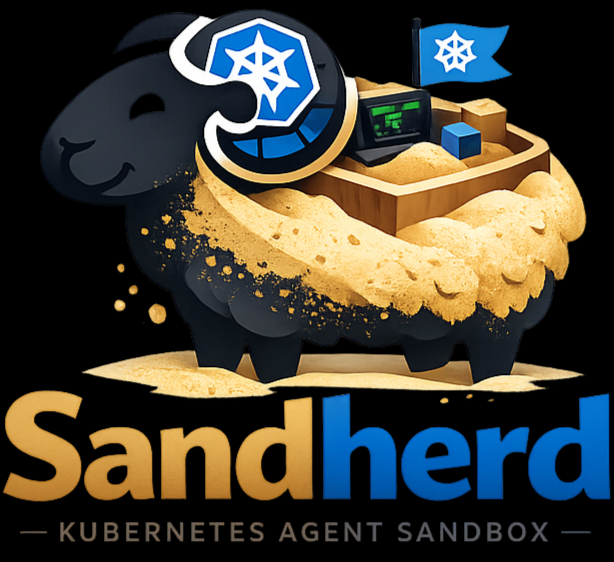
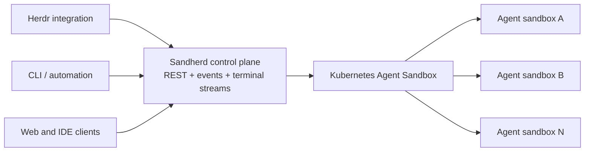

<a id="readme-top"></a>

[![Project Status][status-shield]][roadmap-url]
[![Contributors][contributors-shield]][contributors-url]
[![Forks][forks-shield]][forks-url]
[![Stargazers][stars-shield]][stars-url]
[![Issues][issues-shield]][issues-url]

<br />
<div align="center">
  

  <h1>Sandherd</h1>

  <p align="center">
    <strong>Isolated agents. Unified control.</strong>
    <br />
    A Kubernetes-native control plane for running persistent AI agents in individual sandboxes.
    <br />
    <br />
    <a href="https://github.com/zjpiazza/sandherd/issues/new?labels=bug">Report a bug</a>
    &middot;
    <a href="https://github.com/zjpiazza/sandherd/issues/new?labels=enhancement">Request a feature</a>
  </p>
</div>

<details>
  <summary>Table of Contents</summary>
  <ol>
    <li>
      <a href="#about-the-project">About the Project</a>
      <ul>
        <li><a href="#architecture">Architecture</a></li>
        <li><a href="#design-principles">Design Principles</a></li>
        <li><a href="#contracts">Contracts</a></li>
        <li><a href="#built-with">Built With</a></li>
      </ul>
    </li>
    <li>
      <a href="#getting-started">Getting Started</a>
      <ul>
        <li><a href="#prerequisites">Prerequisites</a></li>
        <li><a href="#installation">Installation</a></li>
      </ul>
    </li>
    <li><a href="#usage">Usage</a></li>
    <li><a href="#development">Development</a></li>
    <li><a href="#roadmap">Roadmap</a></li>
    <li><a href="#contributing">Contributing</a></li>
    <li><a href="#license">License</a></li>
    <li><a href="#acknowledgments">Acknowledgments</a></li>
  </ol>
</details>

## About the Project

Sandherd provides one control plane for creating, observing, and interacting with AI agents that run in separate Kubernetes sandboxes.

Coding agents need more than short-lived command execution. They need durable filesystems, long-running processes, reconnectable terminals, scoped credentials, resource limits, and strong isolation from both the host and other agents. Sandherd combines those capabilities behind a client-neutral API.

[Herdr](https://herdr.dev/) is the first planned interactive integration, but it is not the platform boundary. CLIs, web applications, IDEs, and automation can use the same lifecycle and terminal APIs.

### Architecture



The control plane manages durable agent lifecycle through a REST API. Interactive terminal attachments use reconnectable WebSocket streams. Kubernetes and Agent Sandbox remain implementation details rather than requirements imposed on every client integration.

### Design Principles

- **One agent, one sandbox.** Each agent receives an independent runtime, resource budget, and filesystem.
- **Durable agents, ephemeral attachments.** Closing a terminal must not terminate the agent behind it.
- **Client-neutral control.** Herdr is an integration, not the infrastructure API.
- **Private by default.** Sandboxes are internal workloads with explicit ingress and controlled egress.
- **Kubernetes-native lifecycle.** Scheduling, storage, policies, and runtime isolation use existing Kubernetes primitives.
- **Progressive isolation.** Start with containers and opt into gVisor or Kata Containers where stronger boundaries are required.

### Contracts

- [REST lifecycle API](api/openapi.yaml)
- [Terminal attachment protocol](api/terminal.md)
- [In-sandbox runner protocol and operations](docs/runner.md)
- [Lifecycle control plane](docs/control-plane.md)
- [Resource and API model](docs/adr/0001-resource-and-api-model.md)
- [Agent Sandbox cluster foundation](docs/platform/agent-sandbox.md)

### Built With

- [Go](https://go.dev/)
- [Kubernetes](https://kubernetes.io/)
- [Kubernetes Agent Sandbox](https://github.com/kubernetes-sigs/agent-sandbox)
- [Herdr](https://herdr.dev/)
- [Tailscale](https://tailscale.com/) for optional private access

<p align="right">(<a href="#readme-top">back to top</a>)</p>

## Getting Started

> [!IMPORTANT]
> Sandherd is currently pre-alpha. The architecture is being validated and there is not yet a supported release.

### Prerequisites

The initial deployment target requires:

- A Kubernetes cluster
- `kubectl` access
- A default `StorageClass`
- The Agent Sandbox controller and extensions
- A CNI that enforces Kubernetes `NetworkPolicy`

gVisor or Kata Containers are recommended for running untrusted workloads, but they will not be required for the first development deployment.

Developing Sandherd itself requires Go 1.26 or newer, Node.js 24 for contract validation, and Docker with BuildKit for container builds. See the [local development guide](docs/development.md) for the repository layout and commands.

### Installation

Installation instructions will be added after the first end-to-end release. The intended installation path is a Helm chart with optional GitOps examples.

<p align="right">(<a href="#readme-top">back to top</a>)</p>

## Usage

The planned workflow is deliberately independent of any particular user interface:

1. A client requests a new agent from the Sandherd API.
2. Sandherd creates or claims an isolated Kubernetes sandbox.
3. A runner starts the selected agent inside a persistent PTY.
4. Herdr or another client attaches to the terminal stream.
5. The client can disconnect and reconnect without stopping the agent.
6. Sandherd suspends, resumes, or deletes the sandbox according to policy.

The first integration will map Herdr panes and agent states onto this lifecycle while keeping Kubernetes credentials out of the Herdr client.

<p align="right">(<a href="#readme-top">back to top</a>)</p>

## Development

Run the complete local verification suite with one command:

```sh
make verify
```

The lifecycle `control-plane`, reconnectable `runner`, and `herdr-bridge` command build locally and expose `--version` without contacting Kubernetes or any other external dependency. Detailed setup, build, container, and CI instructions are in the [development guide](docs/development.md).

<p align="right">(<a href="#readme-top">back to top</a>)</p>

## Roadmap

- [ ] Install Agent Sandbox and validate persistent claims
- [ ] Define the Sandherd agent and attachment APIs
- [ ] Build the reconnectable sandbox runner
- [ ] Create, inspect, stop, resume, and delete agents through the control plane
- [ ] Stream an interactive terminal over WebSocket
- [ ] Ship the first Herdr integration
- [ ] Add PVC-backed agent workspaces
- [ ] Add scoped secrets and default-deny network policies
- [ ] Add gVisor runtime support
- [ ] Add warm pools for low-latency agent startup
- [ ] Publish a Helm chart and GitOps deployment examples

See the [open issues][issues-url] for proposed features and known issues.

<p align="right">(<a href="#readme-top">back to top</a>)</p>

## Contributing

Sandherd is at an early stage, so design feedback and focused prototypes are especially valuable. Please read [CONTRIBUTING.md](CONTRIBUTING.md) for branch names, required checks, commit guidance, and issue-linked pull requests. Open an issue before beginning a large architectural change so the approach can be discussed first.

<p align="right">(<a href="#readme-top">back to top</a>)</p>

## License

The project license has not been selected yet. A license will be added before the first public release.

<p align="right">(<a href="#readme-top">back to top</a>)</p>

## Acknowledgments

- [Kubernetes SIG Apps Agent Sandbox](https://github.com/kubernetes-sigs/agent-sandbox)
- [Herdr](https://herdr.dev/)
- [Tailscale Kubernetes Operator](https://tailscale.com/docs/kubernetes-operator)
- [Best README Template](https://github.com/othneildrew/Best-README-Template)

<p align="right">(<a href="#readme-top">back to top</a>)</p>

[status-shield]: https://img.shields.io/badge/status-pre--alpha-orange?style=for-the-badge
[roadmap-url]: https://github.com/zjpiazza/sandherd#roadmap
[contributors-shield]: https://img.shields.io/github/contributors/zjpiazza/sandherd.svg?style=for-the-badge
[contributors-url]: https://github.com/zjpiazza/sandherd/graphs/contributors
[forks-shield]: https://img.shields.io/github/forks/zjpiazza/sandherd.svg?style=for-the-badge
[forks-url]: https://github.com/zjpiazza/sandherd/network/members
[stars-shield]: https://img.shields.io/github/stars/zjpiazza/sandherd.svg?style=for-the-badge
[stars-url]: https://github.com/zjpiazza/sandherd/stargazers
[issues-shield]: https://img.shields.io/github/issues/zjpiazza/sandherd.svg?style=for-the-badge
[issues-url]: https://github.com/zjpiazza/sandherd/issues
